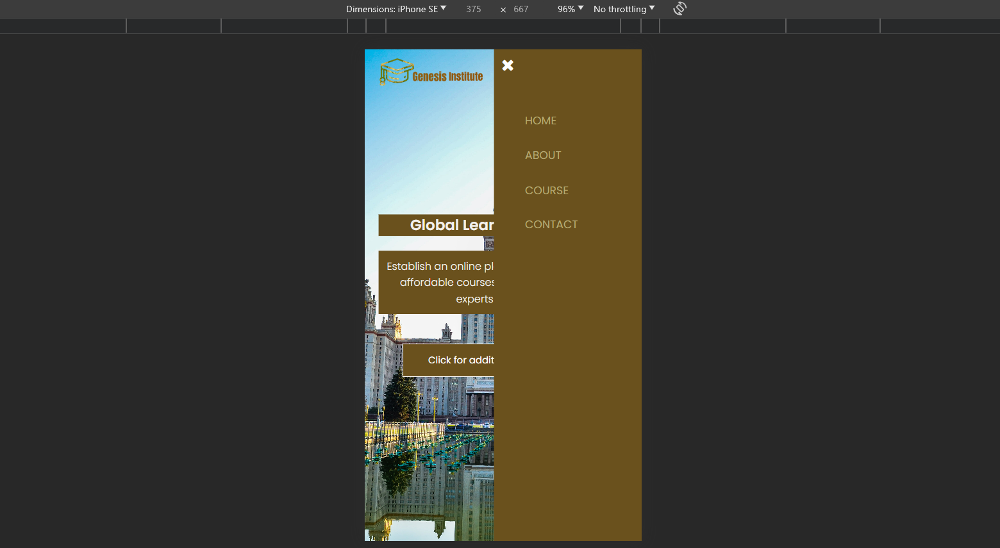
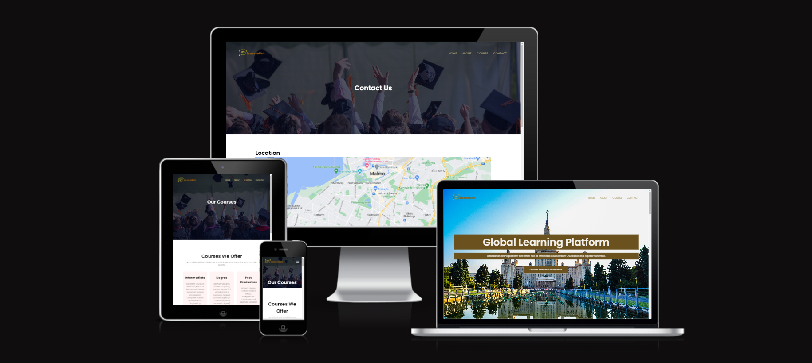
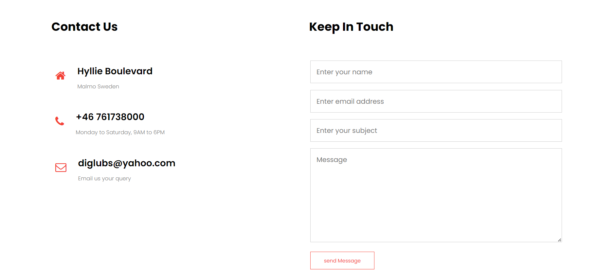
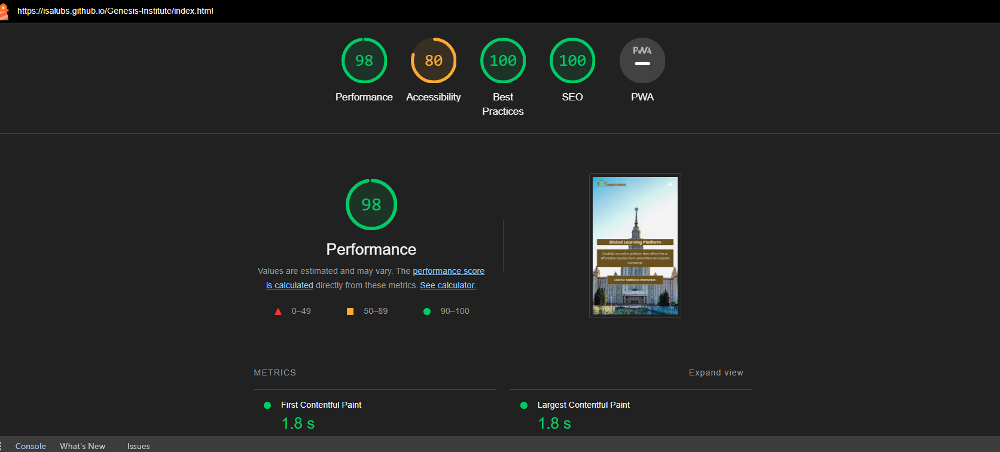
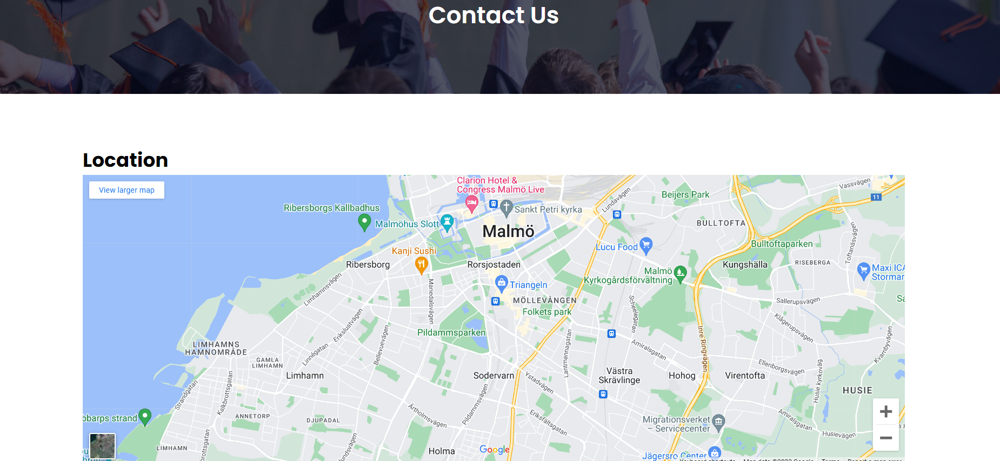
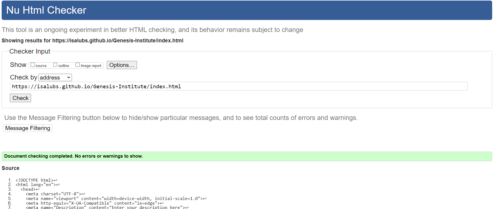

# Genesis Institute
[Visit the website here](https://isalubs.github.io/Genesis-Institute/)

 
Genesis Institute is a comprehensive online platform dedicated to assisting individuals between the ages of 16 and 64 who are eager to pursue higher education. With a mission to guide and support aspiring students on their journey to enrollment in universities, the website encompasses a range of features and resources tailored to facilitate a smooth transition into academic institutions.

Key Features and Goals of the Genesis Institute Website:

1. Informative Guidance:

- Genesis Institute strives to provide detailed and relevant information to individuals exploring educational opportunities. This includes guidance on university programs, admission requirements, and career pathways.

2. Age-Appropriate Resources:

- Recognizing the diverse age range of its users, the website tailors its content to meet the needs and expectations of individuals spanning from 16 to 64 years old. Information is presented in a manner that resonates with users at different life stages.
  
3. University Search and Matching:

- A robust search feature assists users in discovering universities that align with their academic interests, career goals, and personal preferences. This includes filters for programs, location, and campus facilities.

4. Application Support:

- Genesis Institute understands the complexities of the university application process. The website offers valuable resources, tips, and tools to guide users through the application journey, from preparing documentation to navigating admission procedures.
 
5. Career Counseling:

- Beyond enrollment assistance, the website may feature career counseling resources. This includes information about potential career paths associated with different academic disciplines and advice on making informed career decisions.
  
6. User-Friendly Interface:

- The website is designed with a user-friendly interface to ensure easy navigation for individuals of varying technological proficiency. Clear calls-to-action and intuitive menus facilitate a seamless user experience.
  
7. Community and Support:

- Genesis Institute fosters a sense of community among its users. Discussion forums, webinars, or chat features may be incorporated to allow aspiring students to connect, share experiences, and seek advice from peers or mentors.
  
8. Continual Updates:

- To stay current with the dynamic landscape of higher education, the website regularly updates its content, ensuring that users receive the latest information about universities, programs, and admission trends.

---

##  Courses
   Our courses are designed to foster critical thinking, creativity, and practical skills, preparing you for success in a rapidly evolving world. Join Genesis Institute and embark on a transformative educational journey where learning knows no bounds. Explore, discover, and shape your future with us.

  ## Offered Courses
   - Humanities and Social Sciences.
   - Natural Sciences.
   - Mathematics and Computer Science.
  
 ## Categories

- Intermediate:
    Bridge foundational concepts to more specialized subjects, exploring advanced literature, historical periods, computer science specializations, and more.
- Degree:
    Pursue comprehensive academic programs, including Bachelor's, Master's, and Doctoral Degrees across various disciplines.
- Post Graduation:
    Elevate your expertise with Master's and Doctoral Degrees, Postgraduate Certificates, and Diplomas. Specialize in your field through research and taught programs.

 ## Global Campus
   - Campus Locations
      
   - Global Perspectives
    

---- 
## Features
This is a fully responsive website that was designed with a mobile-first approach as this is the most likely way it will be viewed; the page is divided in different sections listed in the navbar. Where employs a monochrome color palette with transparent backgrounds for visual sophistication used,and maintains a consistent and elegant design language through the exclusive use of the Cookie font for headings and body text, this consistency has been used across the website to create a coherent design.

## Navbar
1. Fixed Navbar

- The navigation bar is fixed at the top of the page, providing easy access to navigation links as users scroll down.
## Dropdown Menu

- The "Courses" link has a dropdown menu with multiple options, offering a hierarchical structure to navigate through different sections.
  

## Highlight on Hover

- Navigation links change color upon hovering, providing visual feedback to users.
  

## Responsive Design

- The navigation bar adjusts its layout for smaller screens, ensuring usability on various devices.

## About
1. Introduction

- The "About Us" section provides information about Genesis Institute, introducing users to the purpose and background of the organization.
2. Clear Typography

- The text is presented in a clean and readable format, using appropriate font sizes for headings and body text.
3. Use of Icons

- Icons are utilized alongside text, adding visual elements to enhance the presentation.

## Keep in Touch
1. Contact Form

A contact form is provided for users to get in touch with Genesis Institute. It typically includes fields for name, email, phone, and a message.
1. Call to Action

Clear headings encourage users to get in touch, and the contact form is prominently displayed.
## Colors Used
1. Blue

- The primary color appears to be a shade of blue, used for the navbar and various elements throughout the site.
2. White

- White is used for backgrounds and some text elements, providing a clean and modern look.
3. Black

- Black is used for text and other elements to create contrast against lighter backgrounds.
4. Gray

- Shades of gray are used for additional text and background elements, contributing to a balanced color scheme.

----
## Testimonials
- Student Feedback
Discover what students are saying about their experience at Genesis Institute. Our commitment to providing a top-tier education is reflected in the feedback we receive from those who have embarked on their learning journey with us. Read on to explore the testimonials from our students:
 

----
## Lighthouse
Lighthouse is a feature of Google Chrome developer tools and is used to assess the performance of the website and its features. I achieved a high-performance score initially, as you can see below:

----
## Known bugs and fixes

As part of my testing I wanted to ensure that all of my clickable links worked & opened up in a new page, I found that all pages did not open in new page and contact page delays image uploading when clicked gave a 404 error message some times and page did not  normally work as it should be.

## Solved Bugs
- This has now been resolved and all of the links work.
  
Throughout the entire process, I used Google Dev Tools and Unicorn revealer to debug the website and its layout, this allowed me to check the responsiveness of the site and quickly debug any issues that I came across.
Contact page works normal and no more issues with the image loading.

## Footer

- About Us

Learn more about Genesis Institute's commitment to fostering knowledge, empowerment, and personal growth in education.

  
- Social Media

Connect with us on social media platforms such as Facebook, Twitter, Instagram, and YouTube. Stay updated on the latest news and events.

-----
# Manual Testing

### Navigation Bar
- All links correctly redirect to the correct pages for visitors.
- Navbar is fully responsive on small/medium/large devices.
- Customer sees correct link "Your overview" when logged in.
- Partner sees correct link "Overview" when logged in.
- Navbar collapse works on smaller devices.
- Why Us and Step-by-step is internal anchor links to the homepage and are not available when the user is not on the homepage, see bugs in Readme.
  
### Footer
- All icon links work correctly.
- All links open in a new page.
- The footer appears at the end of the page with javascript.
- Back to top button being displayed on scroll.
- Back to top button takes visitor back to top.
- Footer are not being displayed on pages when user don´t need to scroll, see bugs in Readme.

### Responsivness
Chrome dev tools were used throughout the development of the project to test responsiveness. Responsiveness was tested using Dev Tools to emulate the following devices.

- Iphone 5
- Iphone 6/7/8
- Iphone 6/7/8 Plus
- Iphone X
- Ipad
- Ipad Pro

### Browser Testing
During development, testing was mainly done solely using Google Chrome.

In production the site has been tested on the following browsers.

- Firefox
- Safari
- Opera

### Homepage
- All buttons work and links correctly.
- Icons are being displayed correctly.
- Images are displayed correctly.
- Good contrast between text/images/buttons.

## Technologies Used 

I have used several technologies that have enabled this design to work:

- [HTML](https://developer.mozilla.org/en-US/docs/Web/HTML)
    - Used as the basic building block for the project and to structure the content.
- [CSS](https://developer.mozilla.org/en-US/docs/Learn/Getting_started_with_the_web/CSS_basics)
    - Used to style all the web content across the project. 
- [JavaScript](https://www.javascript.com/)
    - Used for the responsive navbar, form, scroll down arrow and read more/read less button.
- [Google Fonts](https://fonts.google.com/)
    - Used to obtain the fonts linked in the header, fonts used were Playfair and Cookie
- [Font Awesome](https://fontawesome.com/)
    - Used to obtain the social media icons used in the footer and the icons in La Petite Review.
- [Google Developer Tools](https://developers.google.com/web/tools/chrome-devtools)
    - Used as a primary method of fixing spacing issues, finding bugs, and testing responsiveness across the project.
- [GitHub](https://github.com/)
    - Used to store code for the project after being pushed.
- [Git](https://git-scm.com/)
    - Used for version control by utilising the Gitpod terminal to commit to Git and Push to GitHub.
- [Gitpod](https://www.gitpod.io/)
    - Used as the development environment.
- [Balsamiq](https://balsamiq.com/)
    - Used to create the wireframes for the project.
- [AutoPrefixer](https://autoprefixer.github.io/)
    - Used to parse my CSS and ass vendor prefixes.
- [Grammarly](https://www.grammarly.com/)
    - Used to fix the thousands of grammar errors across the project.
- [Unicorn Revealer](https://chrome.google.com/webstore/detail/unicorn-revealer/lmlkphhdlngaicolpmaakfmhplagoaln?hl=en-GB)
    - Used to detect overflow of elements, which allowed me to quickly debug any issues.
- [Coloors](https://coolors.co/)
    - Used to create a colour palette for the design.
- [Fancybox](https://fancyapps.com/fancybox/3/)
    - Used to format my Sri Lanka photo gallery.
- [Favicon.io](https://favicon.io/)
    - Used to create favicon's for my website
- [Tiny.png](https://tinypng.com/)
    - Allowed me to compress my images so that the page would load faster.
- [Color Contrast Accessibility Validator](https://color.a11y.com/)
    - Allowed me to test the colour contrast of my webpage.
- [W3C Markup Validation Service](https://validator.w3.org/) 
    - Used to validate all HTML code written and used in this webpage.
- [W3C CSS Validation Service](https://jigsaw.w3.org/css-validator/#validate_by_input)
    - Used to validate all CSS code written and used in this webpage.
- [Freeformatter CSS Beautify](https://www.freeformatter.com/css-beautifier.html)
    - Used to accurately format my CSS code.
- [Freeformatter HTML Formatter](https://www.freeformatter.com/html-formatter.html)
    - Used to accurately format my HTML code.
- [AmIResponsive](http://ami.responsivedesign.is/)
    - Used to generate repsonsive image used in README file.

---

## HTML and CSS Validation

I validated both my HTML and CSS code multiple times whilst building the website, I did this so that there were not a huge amount of errors/warnings at the final stages of development for me to deal with. This allowed me to incrementally improve my code and upon completion, there were 0 errors found.
 

---
## Images
Website Snapshots
Take a visual tour of our website through these snapshots:

----

## Deployment

I deployed this website by using GitPages and following the below steps:

GitHub pages deployment

1. Log in to GitHub
2. In your Repository section, select the project repository that you want to deploy
3. In the menu located at the top of this section, click 'Settings'
4. Select 'Pages' on the left-hand menu - this is around halfway down
5. In the source section, select branch 'Main' and save
6. The page is then given a site URL which you will see above the source section, it will look like the following:

Please note it can take a while for this link to become fully active.

Forking the GitHub Repository

If you want to make changes to your repository without affecting it, you can make a copy of it by 'Forking' it. This ensures your original repository remains unchanged.

1. Find the relevant GitHub repository
2. In the top right corner of the page, click the Fork button (under your account)
3. Your repository has now been 'Forked' and you have a copy to work on

Cloning the GitHub Repository

Cloning your repository will allow you to download a local version of the repository to be worked on. Cloning can also be a great way to backup your work.

1. Find the relevant GitHub repository
2. Press the arrow on the Code button
3. Copy the link that is shown in the drop-down
4. Now open Gitpod & select the directory location where you would like the clone created
5. In the terminal type 'git clone' & then paste the link you copied in GitHub
6. Press enter and your local clone will be created.

---

## Credits

I have used a number of resources to produce this website, where code has been used found from another source this is credited as a comment within the HTML, CSS.

The following websites/articles were used for research and guidance:

- [Design tips](https://99designs.co.uk/blog/tips/responsive-web-design-key-tips-and-approaches/)

- [Wireframes](https://careerfoundry.com/en/blog/ux-design/wireframing-mobile-apps-websites/)

- [Design tips](https://www.pexels.com/search/cycling/)

 - [HTML](https://developer.mozilla.org/en-US/docs/Web/HTML)
I used code from the following resources:

- [Responsive Navbar](https://www.w3schools.com/howto/howto_js_topnav_responsive.asp)

- [Read more button](https://www.w3schools.com/howto/howto_js_read_more.asp)

- [Image grid](https://www.freecodecamp.org/news/how-to-create-an-image-gallery-with-css-grid-e0f0fd666a5c/)

- [Visually hidden elements](https://www.w3.org/WAI/tutorials/forms/labels/)
  
- [Free logo maker](https://app.logomakr.com/)

----

## Acknowledgments

Thank you for visiting the Genesis Institute website. Explore, learn, and embark on a transformative educational journey with us!

I would like to thank my course mentor Harry Dhillon for his support and guidance throughout the course of the project and my fellow student Jonathan_Zakrisson_Alumnus  for their support & feedback.
