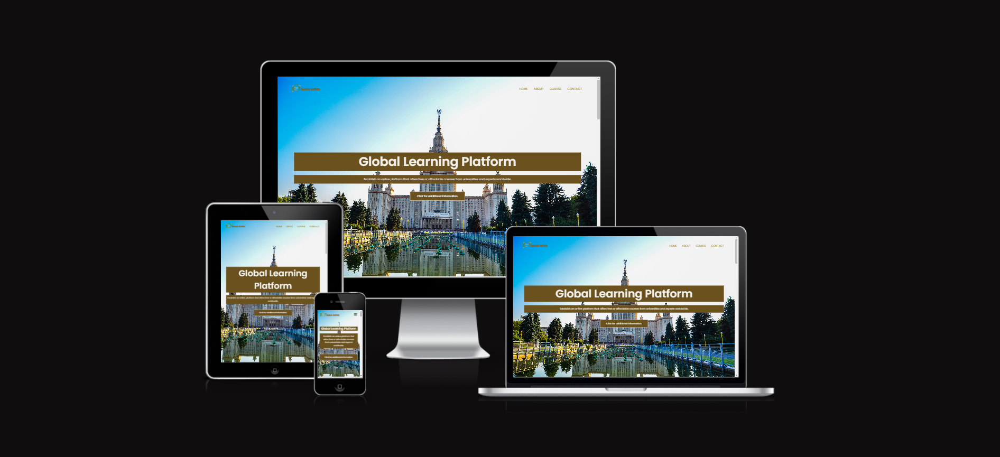
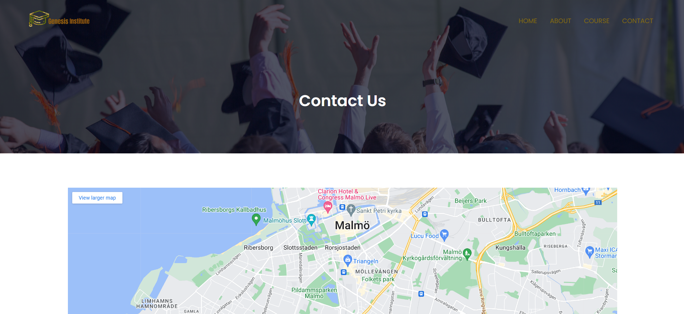

# Genesis Institute

view the website here:
<https://isalubs.github.io/Genesis-Institute/>
 
Welcome to the Genesis Institute's official website! This web platform serves as a gateway to a world-class learning experience, offering a diverse range of courses and resources to empower individuals globally. Below is a brief overview of the key sections and features of our website:

## Table of Contents

1. **Introduction**

#Description

Welcome to Genesis Institute, your gateway to a world-class learning experience! We are dedicated to providing high-quality education on a global scale. Our platform offers a diverse range of courses, from Humanities and Social Sciences to Natural Sciences, Mathematics, and Computer Science. As a pioneer in online education, we aim to empower individuals worldwide by providing accessible and affordable courses from renowned universities and experts. Explore the endless possibilities of learning with Genesis Institute and embark on a transformative educational journey.

#Navigation

 Our website is designed with user-friendliness in mind, ensuring seamless navigation for an optimal browsing experience.
 Home: Begin your journey on our home page, where you'll find an overview of our global learning platform and its offerings.
 About: Dive into the heart of Genesis Institute. Learn about our mission, vision, and commitment to fostering knowledge, empowerment, and personal growth in education

##  Courses
   
    #Offered Courses
   - Humanities and Social Sciences.
   - Natural Sciences.
   - Mathematics and Computer Science.
  
    #Course Categorie
    - Intermediate.
    - Degree.
    - Post Graduation.

 ## Global Campus
   - Campus Locations
      
   - Global Perspectives
    

## Facilities
   
#State-of-the-Art Facilities.

At Genesis Institute, we are dedicated to providing an unparalleled learning environment equipped with state-of-the-art facilities. Our commitment to excellence extends beyond the digital realm to ensure that our physical spaces enhance the overall educational experience. Explore the world-class facilities that await you.

#World-Class Library.

Immerse yourself in a world of knowledge within our world-class library. Our extensive collection spans various disciplines, providing access to the latest publications, research materials, and academic resources. Advanced technology enhances the learning experience, offering a pinnacle of knowledge access.Largest Playground
Embrace the importance of holistic development in our expansive playground. The largest playground on our campus provides a vast and diverse space for recreational activities, fostering physical well-being and a sense of community among our students.

#Tasty and Healthy Food.

Nourish both body and mind with our culinary offerings. Our cafeteria provides tasty and healthy food options, combining delicious flavors with nutritious ingredients. Enjoy a variety of meals that cater to different dietary preferences, ensuring a well-rounded and satisfying culinary experience.

## Testimonials
- Student Feedback
Discover what students are saying about their experience at Genesis Institute. Our commitment to providing a top-tier education is reflected in the feedback we receive from those who have embarked on their learning journey with us. Read on to explore the testimonials from our students:
 

---

##  Navbar
The navbar is placed on top of a responsive image which acts as a header, when viewed on smaller screens I opted for the menu to collapse into a hamburger icon as I still wanted to image to be seen. The image I have chosen is representative of the site's theme and incorporates the colour palette, it immediately encourages the user to think of being on holiday and entices them to read further. 

---
## Technologies Used 

I have used several technologies that have enabled this design to work:

- [HTML](https://developer.mozilla.org/en-US/docs/Web/HTML)
    - Used as the basic building block for the project and to structure the content.
- [CSS](https://developer.mozilla.org/en-US/docs/Learn/Getting_started_with_the_web/CSS_basics)
    - Used to style all the web content across the project. 
- [JavaScript](https://www.javascript.com/)
    - Used for the responsive navbar, form, scroll down arrow and read more/read less button.
- [Google Fonts](https://fonts.google.com/)
    - Used to obtain the fonts linked in the header, fonts used were Playfair and Cookie
- [Font Awesome](https://fontawesome.com/)
    - Used to obtain the social media icons used in the footer and the icons in La Petite Review.
- [Google Developer Tools](https://developers.google.com/web/tools/chrome-devtools)
    - Used as a primary method of fixing spacing issues, finding bugs, and testing responsiveness across the project.
- [GitHub](https://github.com/)
    - Used to store code for the project after being pushed.
- [Git](https://git-scm.com/)
    - Used for version control by utilising the Gitpod terminal to commit to Git and Push to GitHub.
- [Gitpod](https://www.gitpod.io/)
    - Used as the development environment.
- [Balsamiq](https://balsamiq.com/)
    - Used to create the wireframes for the project.
- [AutoPrefixer](https://autoprefixer.github.io/)
    - Used to parse my CSS and ass vendor prefixes.
- [Grammarly](https://www.grammarly.com/)
    - Used to fix the thousands of grammar errors across the project.
- [Unicorn Revealer](https://chrome.google.com/webstore/detail/unicorn-revealer/lmlkphhdlngaicolpmaakfmhplagoaln?hl=en-GB)
    - Used to detect overflow of elements, which allowed me to quickly debug any issues.
- [Coloors](https://coolors.co/)
    - Used to create a colour palette for the design.
- [Fancybox](https://fancyapps.com/fancybox/3/)
    - Used to format my Sri Lanka photo gallery.
- [Favicon.io](https://favicon.io/)
    - Used to create favicon's for my website
- [Tiny.png](https://tinypng.com/)
    - Allowed me to compress my images so that the page would load faster.
- [Color Contrast Accessibility Validator](https://color.a11y.com/)
    - Allowed me to test the colour contrast of my webpage.
- [W3C Markup Validation Service](https://validator.w3.org/) 
    - Used to validate all HTML code written and used in this webpage.
- [W3C CSS Validation Service](https://jigsaw.w3.org/css-validator/#validate_by_input)
    - Used to validate all CSS code written and used in this webpage.
- [Freeformatter CSS Beautify](https://www.freeformatter.com/css-beautifier.html)
    - Used to accurately format my CSS code.
- [Freeformatter HTML Formatter](https://www.freeformatter.com/html-formatter.html)
    - Used to accurately format my HTML code.
- [AmIResponsive](http://ami.responsivedesign.is/)
    - Used to generate repsonsive image used in README file.

---

## HTML and CSS Validation

I validated both my HTML and CSS code multiple times whilst building the website, I did this so that there were not a huge amount of errors/warnings at the final stages of development for me to deal with. This allowed me to incrementally improve my code and upon completion, there were 0 errors found.
 

---
## Images
Website Snapshots
Take a visual tour of our website through these snapshots:

----